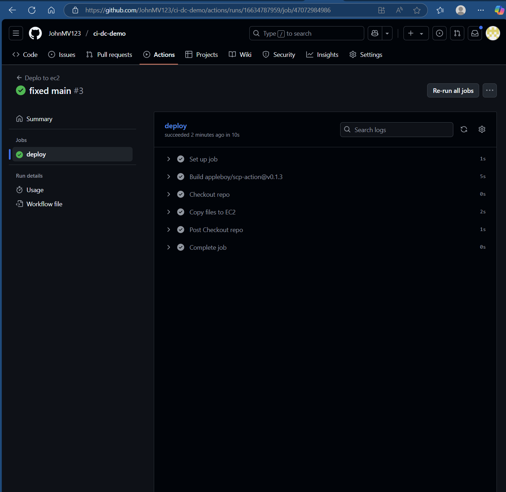
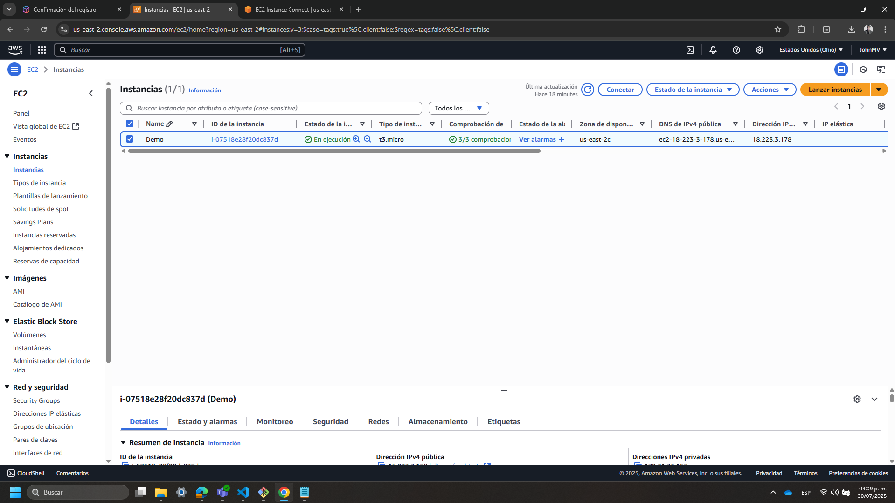
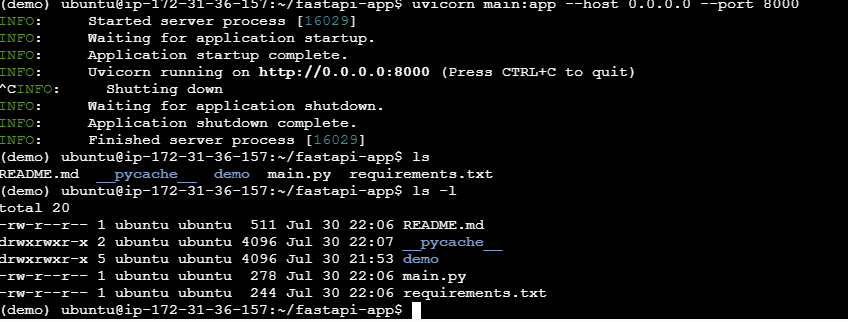
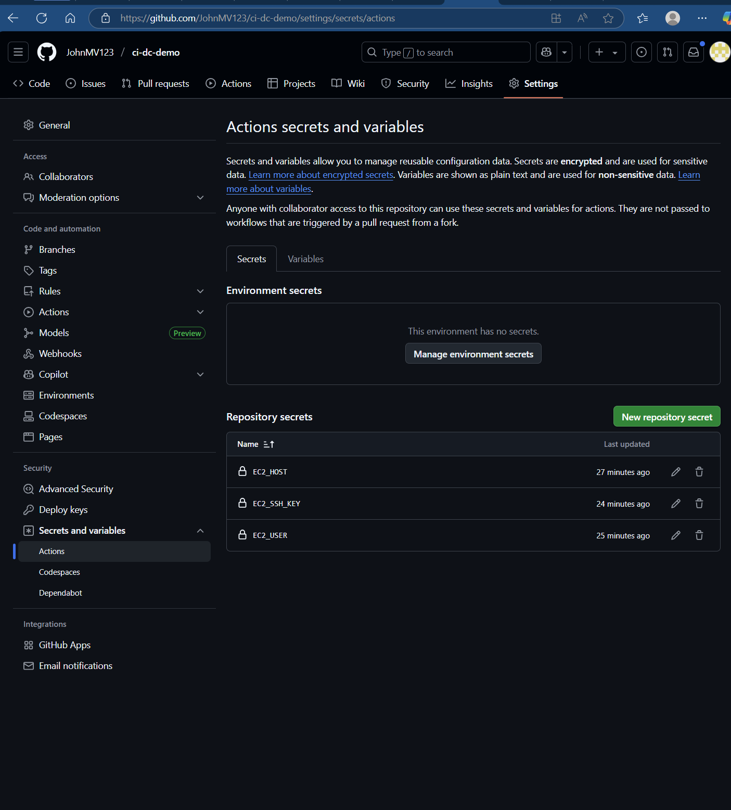

# ci-dc-demo Jonathan

**Categoría:** Básico  
**Tecnología especializada:** Python + FastAPI  

## Descripción
API simple que responde `/predict?number=...` si es par o impar.

## Pipeline (CI/CD)
1. Push a `main` → GitHub Actions  
2. Copia el código en automatico a la instancia de EC2   
3. Corre servidor FastAPI desde la consola de la instancia (entrar)  

## Buenas prácticas de seguridad
- Uso de **GitHub Secrets** para credenciales  
- **Permisos limitados** de `GITHUB_TOKEN`  

## Evidencias
- Capturas del pipeline:
  
Flow:
- Despliegue en EC2  

- Uso de Secrets
